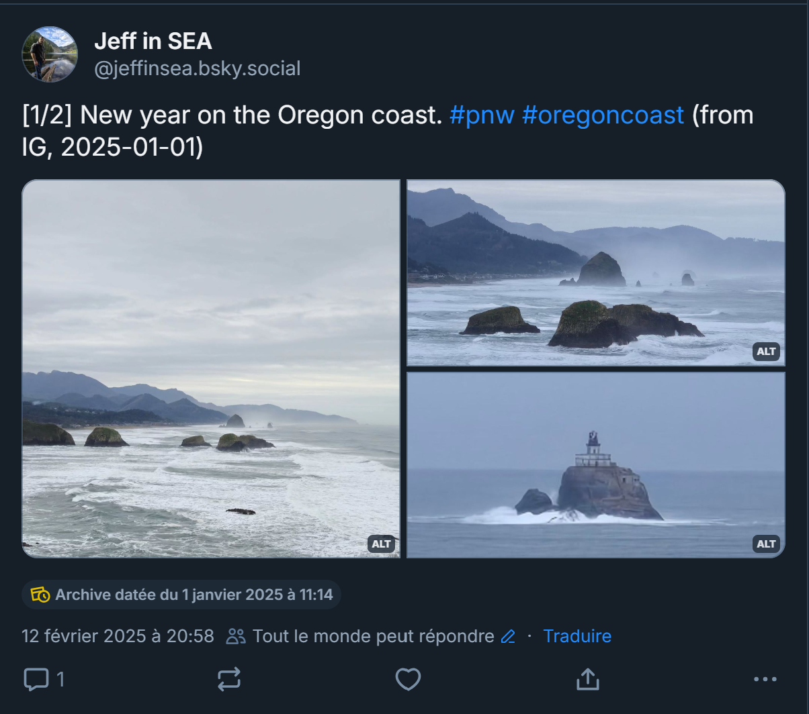

# Migrate your Instagram archive to Bluesky (python version)

This repo contains a python script that can help you migrate your content from Instagram to Bluesky. The scripts as follows:
- you download your archive from Instagram as a zip file and decompress it locally
- the script prepares a queue for your migration by transforming your instagram posts into bluesky-compatible posts
- the script then posts all the elements of the queue to bluesky.

As noted in the [LICENSE](./LICENSE), the script is provided as-is without guarantee. It is EXPERIMENTAL and should be run carefully. There is low risks of messing up, but it still exists.

## Key features

A couple of key features of this script:
- It transforms your IG posts to work with the bluesky posting limits (see ["what to expect"](#what-to-expect) below).
- The migration queue and its state is written on disk, so it can be resumed or rolled back.
- The script will let you "test" migrating one post at a time before migrating in bulk.

## :warning: What to expect :warning:

### Refactoring to fit Bluesky limits

Bluesky has **posting limits** that make it impossible to migrate all your IG posts as-is.

In particular:
- no more than 4 images per post
- no more than 1 video per post
- you can't mix images and videos

As an example, if your IG post has 7 media content mixing video and image, it just won't work on Bluesky.

What this script does is in that situation: it **refactors each IG into a Bluesky thread**.

For instance if you have a post made of 7 images, it will create 2 posts:
- 1 post with 4 images (the firsts in order)
- 1 reply with 3 images (the remaining in order)

Another example, if you have a post made of 3 images, 1 video, 1 video, 1 image, it will create:
- 1 post with 4 images (all images are grouped together)
- 1 reply with the 1st video
- 1 reply with the 2nd video

### Figuring out the text for each post

The IG archive you download has the text in 2 places. The text can be either the main text of the post, or attached to the first image of the post. The script will figure out which one to use automatically.

The text of the posts will be changed by the script.

It shows as follows:

> "\[1/2\] Monday, walking through Paris, (not so) random places that look very French #paris #france #walkingmeditation (from IG, 2019-07-05)"

Where `1/2` is the index in the thread it built (if post is split), and `(from IG, YYYY-MM-DD)` depends on the post original date in IG.

### Date: creation date vs posting date

When migrating your IG posts to bluesky, there will be 2 dates associated with your posts:

- the posting date: it is the date at which you ran the migration script,
- the creation date: it is the date of the original IG post

Bluesky allows this, and it will be surfaced as shown below:



On this example, the original post was created on Jan 1st, while the migration script ran on February 12. The creation date is surfaced just below the pictures ("Archive datée du..." in french).

For extra transparency, the migration script adds the original date as a suffix in the post text ("from IG, 2025-01-01").

### Known limits

There's a couple of things I did not have bandwidth to implement:
- Working with image size limits: if your image file is above 950K, it will be rejected. The script will fail, but you can resume it after you reduce the size of the corresponding image.
- Date timezone: I did not have patience to verify if the timezone of the IG archive was in UTC or not, so there might be some weird date translation here.

## How to

### A. Get the requirements

1. Go to Instagram (web) and figure out how to download your archive. It might be [starting from here](https://www.instagram.com/download/request), but they change this process all the time, it's hard to document.

    > :warning: When prompted during the download process, specify you want to download your content for **all time**, and in format **JSON** (not HTML), and in **high quality**.

2. Clone this repository locally (or [download the archive](https://github.com/jfomhover/instagram-to-bluesky-python/archive/refs/heads/main.zip) from GitHub):

    ```bash
    git clone https://github.com/jfomhover/instagram-to-bluesky-python.git
    cd instagram-to-bluesky-python
    ```

3. Install the python dependencies (`python>=3.10`)

    ```bash
    pip install -r ./requirements.txt
    ```

### B. Import IG posts into a migration queue

```bash
python run.py import --archive-folder <your_ig_archive_folder>
```

It will create a folder `queue/` with a whole bunch of json files. Each represents one post to be sent to Bluesky.

### C. Test by migrating 1 post

Run the script with the argument `--pick 1` to migrate only one post from your queue. This number is an IG `archive_index` meaning if this IG post is split into a thread, it will post the whole thread (a good test).

```bash
python run.py migrate --archive-folder <your_ig_archive_folder> --username <your_bsky_account> --pick <N>
```

You'll be prompted to give your bluesky password.

You can rollback this by using:

```bash
python run.py rollback --archive-folder <your_ig_archive_folder> --username <your_bsky_account>
```

It will delete this post only.

### D. Migrate the bulk of your IG posts

Run the script with the following arguments:

```bash
python run.py migrate --archive-folder <your_ig_archive_folder> --username <your_bsky_account>
```

You'll be prompted to give your bluesky password.

If any error occurs (ex: [image size limit](#known-limits)), you can always fix locally and resume by using the command again. The script **writes the state of completed posts** in the `queue/` folder so it knows where to resume.

You can always rollback this by using:

```bash
python run.py rollback --archive-folder <your_ig_archive_folder> --username <your_bsky_account>
```

It will delete all bluesky posts that were previously migrated from the queue.
